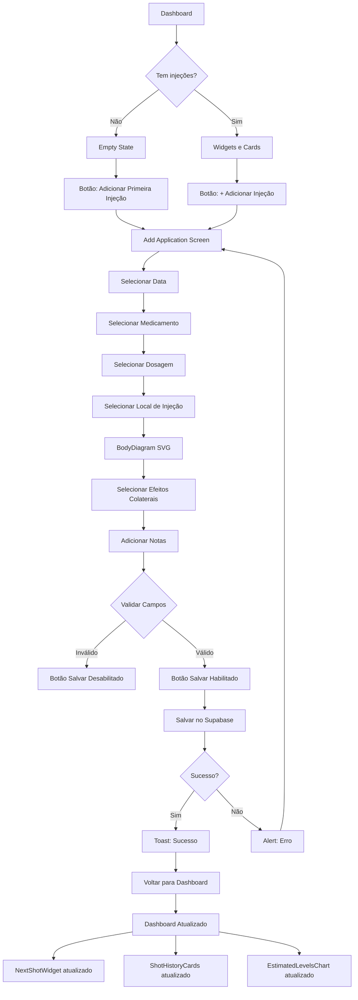
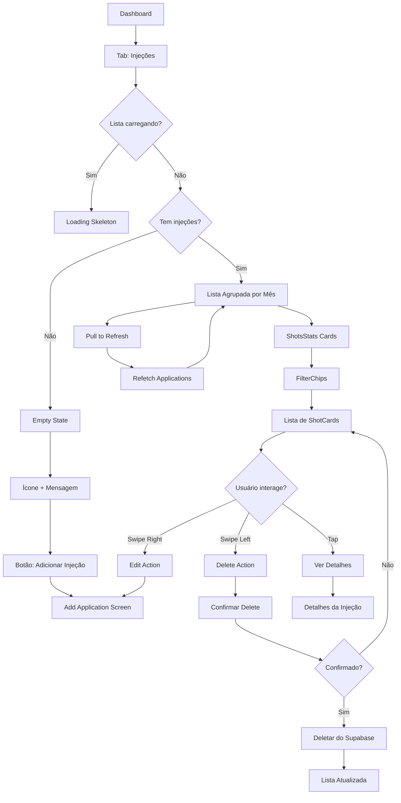
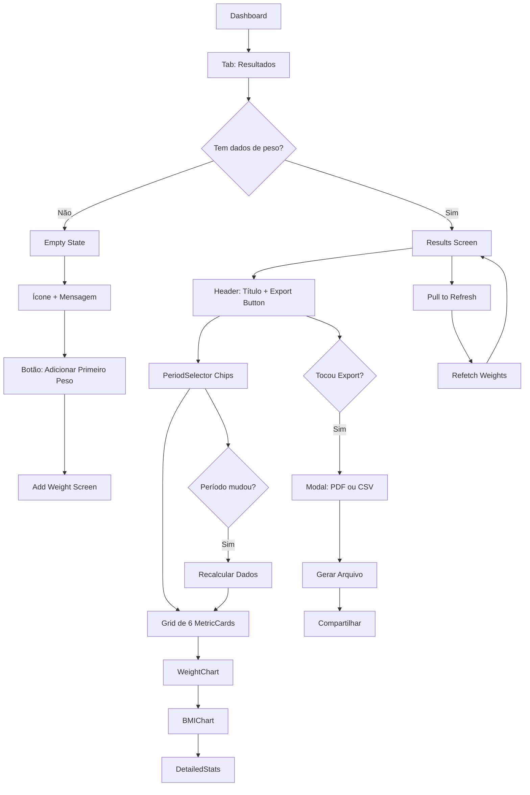
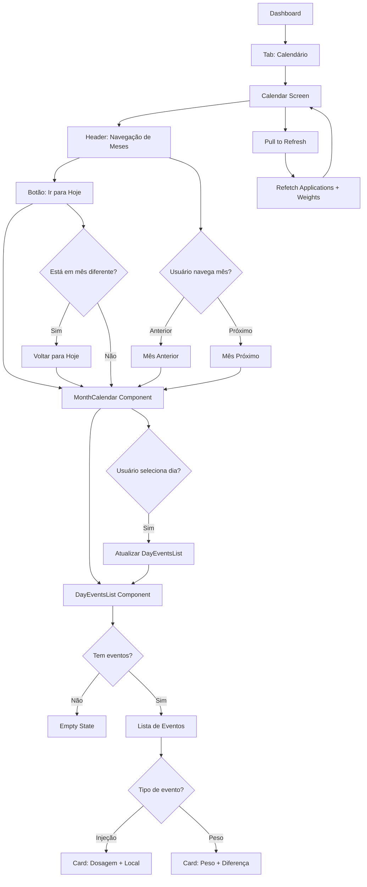
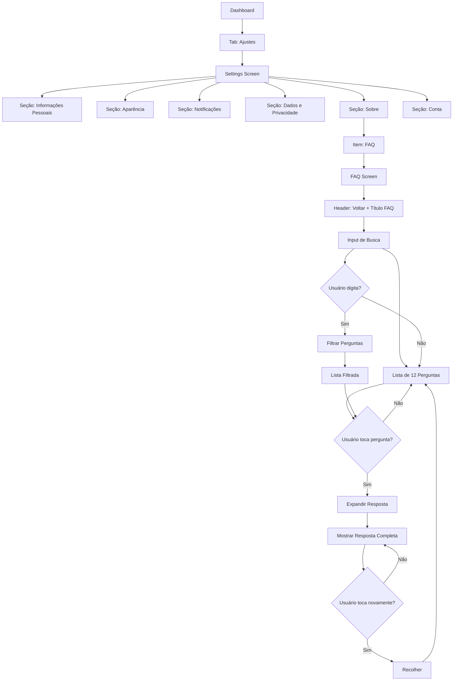
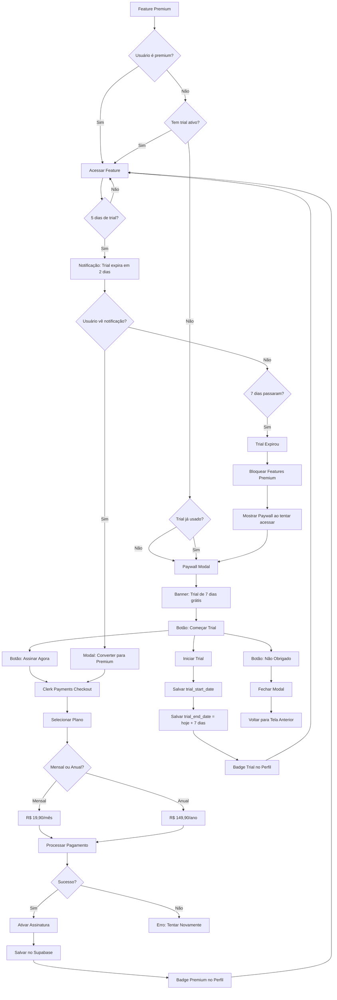
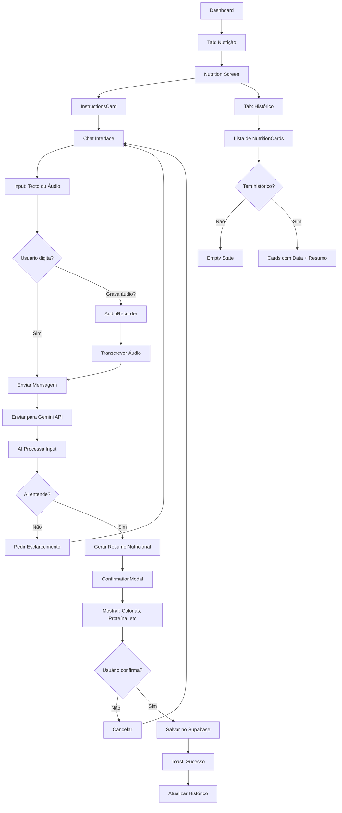
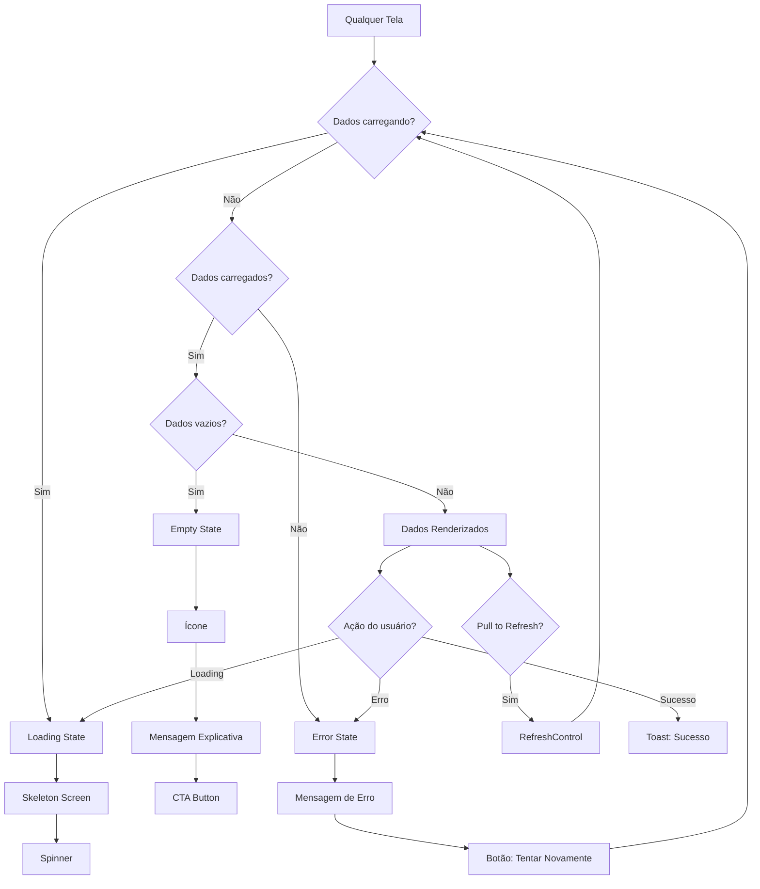

# Mapa de Fluxos: Shotsy → Mounjaro Tracker

**Data de Criação:** 2025-01-27  
**Versão:** 1.0  
**Baseado em:** 37 screenshots do Shotsy + análise do repositório Mounjaro

---

## Fluxo Principal: Abertura → Onboarding → Dashboard

```mermaid
graph TD
    A[Abertura do App] --> B{Usuário autenticado?}
    B -->|Não| C[Tela Welcome]
    B -->|Sim| D{Tem onboarding completo?}
    D -->|Não| E[Onboarding Flow]
    D -->|Sim| F[Dashboard]
    
    C --> C1[Slide 1: Bem-vindo]
    C1 --> C2[Slide 2: Acompanhe Progresso]
    C2 --> C3[Slide 3: Alcance Objetivos]
    C3 --> C4{Tem conta?}
    C4 -->|Sim| G[Sign In]
    C4 -->|Não| H[Sign Up]
    
    G --> I[Autenticação Clerk]
    H --> I
    I --> D
    
    E --> E1[Step 1: WelcomeScreen]
    E1 --> E2[Step 2: WidgetsIntroScreen]
    E2 --> E3[Step 3: ChartsIntroScreen]
    E3 --> E4[Step 4: CustomizationIntroScreen]
    E4 --> E5[Step 5: AlreadyUsingGLP1Screen]
    E5 --> E6[Step 6: MedicationSelectionScreen]
    E6 --> E7[Step 7: InitialDoseScreen]
    E7 --> E8[Step 8: DeviceTypeScreen]
    E8 --> E9[Step 9: InjectionFrequencyScreen]
    E9 --> E10[Step 10: EducationGraphScreen]
    E10 --> E11[Step 11: HealthDisclaimerScreen]
    E11 --> E12[Step 12: HeightInputScreen]
    E12 --> E13[Step 13: CurrentWeightScreen]
    E13 --> E14[Step 14: StartingWeightScreen]
    E14 --> E15[Step 15: TargetWeightScreen]
    E15 --> E16[Step 16: MotivationalMessageScreen]
    E16 --> E17[Step 17: WeightLossRateScreen]
    E17 --> E18[Step 18: DailyRoutineScreen]
    E18 --> E19[Step 19: FluctuationsEducationScreen]
    E19 --> E20[Step 20: FoodNoiseScreen]
    E20 --> E21[Step 21: SideEffectsConcernsScreen]
    E21 --> E22[Step 22: MotivationScreen]
    E22 --> E23[Step 23: AppRatingScreen]
    E23 --> F
    
    F --> F1[Dashboard/Resumo]
```



---

## Fluxo: Dashboard → Adicionar Injeção



---

## Fluxo: Dashboard → Lista de Injeções



---

## Fluxo: Dashboard → Resultados



---

## Fluxo: Dashboard → Calendário



---

## Fluxo: Dashboard → Configurações → FAQ



---

## Fluxo: Paywall → Free Trial → Premium



---

## Fluxo: Adicionar Nutrição (AI Chat)



---

## Fluxo: Estados e Erros



---

## Hierarquia de Telas (Árvore)

```
Mounjaro Tracker
│
├── (auth) [Rotas não autenticadas]
│   ├── welcome.tsx [Carrossel inicial]
│   ├── sign-in.tsx [Login]
│   ├── sign-up.tsx [Cadastro]
│   └── onboarding-flow.tsx [23 telas de onboarding]
│
├── (tabs) [Rotas autenticadas - Bottom Navigation]
│   ├── dashboard.tsx [Resumo/Home]
│   ├── injections.tsx [Lista de Injeções]
│   ├── results.tsx [Resultados e Gráficos]
│   ├── calendar.tsx [Calendário]
│   ├── settings.tsx [Configurações]
│   │
│   └── [Modais/Stack] [Telas de ação]
│       ├── add-application.tsx [Adicionar Injeção]
│       ├── add-weight.tsx [Adicionar Peso]
│       ├── add-nutrition.tsx [Nutrição com IA]
│       ├── add-medication.tsx [Adicionar Medicamento]
│       ├── add-side-effect.tsx [Adicionar Efeito]
│       ├── notification-settings.tsx [Config Notificações]
│       ├── profile.tsx [Perfil do Usuário]
│       └── faq.tsx [FAQ - A IMPLEMENTAR]
│
└── [Sistema] [Componentes globais]
    ├── PaywallModal.tsx [A IMPLEMENTAR]
    ├── PremiumGate.tsx [A IMPLEMENTAR]
    └── TrialNotification.tsx [A IMPLEMENTAR]
```

---

## Decisões de Fluxo

### 1. Onboarding
- **Shotsy:** 23 telas sequenciais obrigatórias
- **Mounjaro Atual:** 4 telas (basic, avatar, goal, personality)
- **Decisão:** Implementar todas as 23 telas do Shotsy

### 2. Paywall
- **Shotsy:** Paywall com trial opcional
- **Mounjaro Atual:** Não implementado
- **Decisão:** Implementar paywall com trial obrigatório de 7 dias

### 3. FAQ
- **Shotsy:** FAQ completa com busca
- **Mounjaro Atual:** Não existe
- **Decisão:** Implementar FAQ completa conforme Shotsy

### 4. Navegação
- **Shotsy:** 5 tabs fixas no bottom
- **Mounjaro Atual:** 5 tabs implementadas
- **Decisão:** Manter estrutura atual (já está correta)

---

**Última Atualização:** 2025-01-27  
**Próxima Revisão:** Após implementação P0

