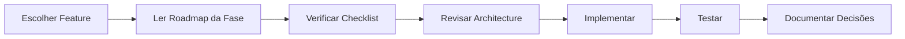
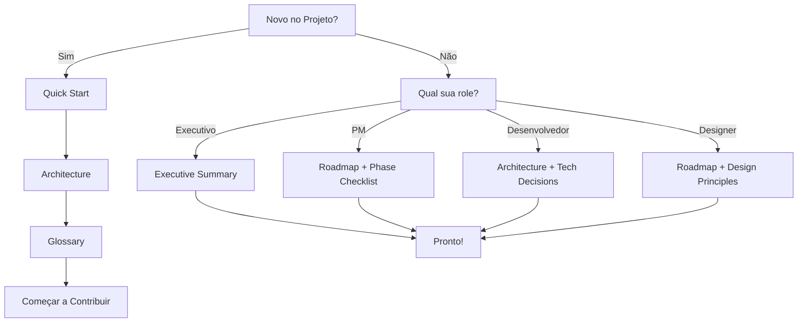
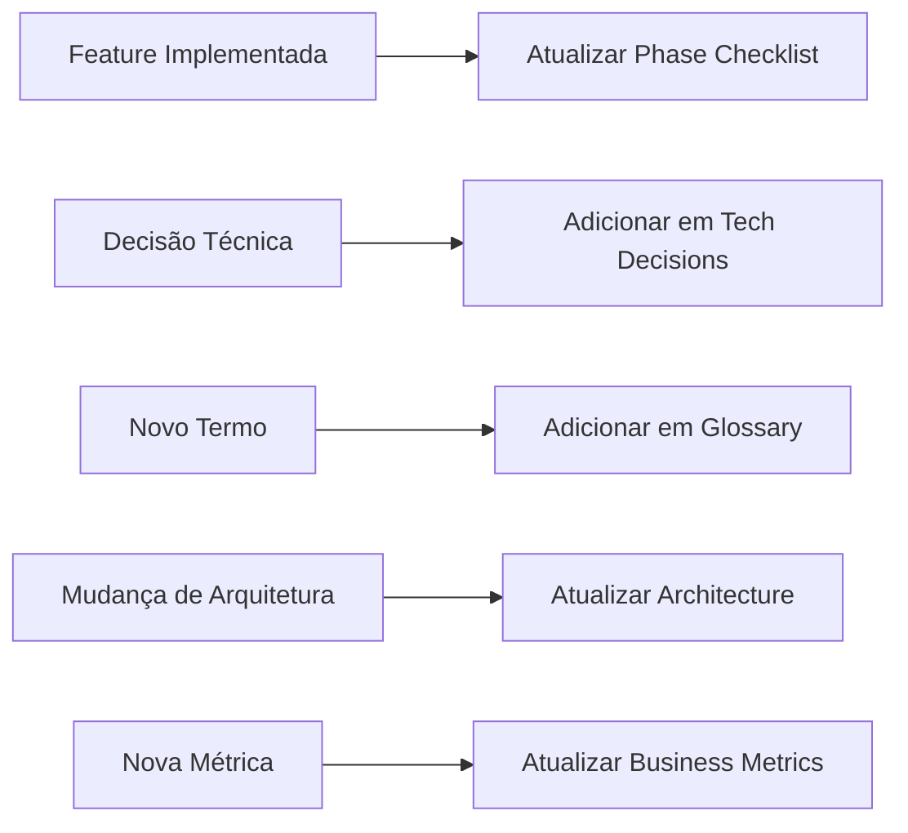

# Shotsy Documentation Index

> Índice visual completo de toda a documentação

**Última Atualização:** 2025-11-01

---

## Mapa de Navegação

```
📚 SHOTSY DOCUMENTATION
│
├─📋 PLANEJAMENTO & VISÃO
│  ├─ Executive Summary (1 página para stakeholders)
│  ├─ Product Vision (visão e diferenciação)
│  ├─ Roadmap Master (10 fases detalhadas)
│  ├─ Phase Checklist (implementação por fase)
│  └─ Business Metrics (KPIs de sucesso)
│
├─🔧 TÉCNICO
│  ├─ Architecture (arquitetura completa)
│  ├─ Tech Stack (stack e decisões)
│  ├─ Tech Decisions Log (por que cada tecnologia)
│  ├─ API Docs (documentação de APIs)
│  └─ Database Schema (estrutura do banco)
│
├─📖 GUIAS PRÁTICOS
│  ├─ Quick Start (rodar em 15 min)
│  ├─ Implementation Guide (como implementar features)
│  ├─ Code Standards (padrões de código)
│  ├─ Testing Guide (estratégia de testes)
│  └─ Glossary (terminologia completa)
│
└─📝 DECISÕES
   ├─ Tech Decisions (escolhas de tecnologia)
   └─ Architecture Decisions (ADRs)
```

---

## Por Persona

### 👔 Sou Executivo/Stakeholder

**Comece aqui:**

1. [Executive Summary](./planning/EXECUTIVE-SUMMARY.md) - Visão em 1 página
2. [Product Vision](../../SHOTSY-THINK-DIFFERENT-ROADMAP.md) - O que estamos construindo
3. [Business Metrics](./planning/EXECUTIVE-SUMMARY.md#métricas-de-sucesso) - Como medir sucesso

**Tempo estimado:** 15 minutos

---

### 🎨 Sou Product Manager

**Comece aqui:**

1. [Executive Summary](./planning/EXECUTIVE-SUMMARY.md) - Visão geral
2. [Roadmap Master](../../SHOTSY-THINK-DIFFERENT-ROADMAP.md) - 10 fases detalhadas
3. [Phase Checklist](./planning/PHASE-IMPLEMENTATION-CHECKLIST.md) - O que fazer em cada fase
4. [Tech Decisions](./decisions/TECH-DECISIONS.md) - Entender escolhas técnicas

**Tempo estimado:** 45 minutos

---

### 💻 Sou Desenvolvedor (Novo no Projeto)

**Onboarding path:**

**Dia 1 - Setup (1-2 horas)**

1. [Quick Start](./guides/QUICK-START.md) - Rodar app localmente
2. [Architecture](./technical/ARCHITECTURE.md) - Entender estrutura
3. [Glossary](./guides/GLOSSARY.md) - Aprender terminologia

**Dia 2 - Deep Dive (2-3 horas)** 4. [Tech Stack](./technical/ARCHITECTURE.md#technology-stack) - Stack completo 5. [Code Standards](./guides/QUICK-START.md#git-workflow-resumo) - Padrões de código 6. [Tech Decisions](./decisions/TECH-DECISIONS.md) - Por que cada escolha

**Dia 3+ - Contribuir** 7. Pegar issue no GitHub 8. [Implementation Guide](./guides/QUICK-START.md#estrutura-do-projeto-rápida) - Começar a codar

---

### 🎨 Sou Designer

**Comece aqui:**

1. [Product Vision](../../SHOTSY-THINK-DIFFERENT-ROADMAP.md#-princípios-de-design-think-different) - Princípios de design
2. [Roadmap](../../SHOTSY-THINK-DIFFERENT-ROADMAP.md) - Features por fase
3. [Executive Summary](./planning/EXECUTIVE-SUMMARY.md) - Contexto de negócio

**Tempo estimado:** 30 minutos

---

### 🔬 Sou QA/Tester

**Comece aqui:**

1. [Quick Start](./guides/QUICK-START.md) - Setup ambiente
2. [Phase Checklist](./planning/PHASE-IMPLEMENTATION-CHECKLIST.md) - O que testar em cada fase
3. [Architecture](./technical/ARCHITECTURE.md#testing-strategy) - Estratégia de testes

**Tempo estimado:** 30 minutos

---

## Por Tarefa

### 🚀 Quero Implementar uma Feature



**Documentos:**

1. [Roadmap Master](../../SHOTSY-THINK-DIFFERENT-ROADMAP.md) - Spec da feature
2. [Phase Checklist](./planning/PHASE-IMPLEMENTATION-CHECKLIST.md) - Checklist de implementação
3. [Architecture](./technical/ARCHITECTURE.md) - Padrões arquiteturais
4. [Tech Decisions](./decisions/TECH-DECISIONS.md) - Adicionar novas decisões

---

### 🐛 Quero Debugar um Bug

**Documentos:**

1. [Architecture](./technical/ARCHITECTURE.md#error-handling--resilience) - Error handling patterns
2. [Glossary](./guides/GLOSSARY.md) - Entender terminologia
3. [Quick Start](./guides/QUICK-START.md#troubleshooting-comum) - Troubleshooting comum

---

### 📊 Quero Entender Métricas

**Documentos:**

1. [Executive Summary](./planning/EXECUTIVE-SUMMARY.md#métricas-de-sucesso) - North Star Metrics
2. [Roadmap](../../SHOTSY-THINK-DIFFERENT-ROADMAP.md#-métricas-de-sucesso-think-different) - Métricas por categoria
3. [Architecture](./technical/ARCHITECTURE.md#monitoring--observability) - Setup de monitoring

---

### 🔐 Quero Entender Segurança/Privacy

**Documentos:**

1. [Architecture](./technical/ARCHITECTURE.md#security-architecture) - Arquitetura de segurança
2. [Tech Decisions](./decisions/TECH-DECISIONS.md) - Escolhas de security
3. [Roadmap](../../SHOTSY-THINK-DIFFERENT-ROADMAP.md) - Privacy em cada fase

---

### 🎯 Quero Priorizar Features

**Documentos:**

1. [Roadmap](../../SHOTSY-THINK-DIFFERENT-ROADMAP.md#-priorização-sugerida) - Priorização sugerida
2. [Executive Summary](./planning/EXECUTIVE-SUMMARY.md#roadmap-em-3-atos) - Roadmap em atos
3. [Phase Checklist](./planning/PHASE-IMPLEMENTATION-CHECKLIST.md) - Dependências entre fases

---

## Documentos por Tipo

### 📄 Documentos Estratégicos

| Documento                                                               | Audiência       | Tempo Leitura | Última Atualização |
| ----------------------------------------------------------------------- | --------------- | ------------- | ------------------ |
| [Executive Summary](./planning/EXECUTIVE-SUMMARY.md)                    | Executivos, PMs | 10 min        | 2025-11-01         |
| [Roadmap Master](../../SHOTSY-THINK-DIFFERENT-ROADMAP.md)               | Todos           | 60 min        | 2025-11-01         |
| [Business Metrics](./planning/EXECUTIVE-SUMMARY.md#métricas-de-sucesso) | PMs, Executivos | 5 min         | 2025-11-01         |

### 🔧 Documentos Técnicos

| Documento                                                  | Audiência        | Tempo Leitura | Última Atualização |
| ---------------------------------------------------------- | ---------------- | ------------- | ------------------ |
| [Architecture](./technical/ARCHITECTURE.md)                | Desenvolvedores  | 45 min        | 2025-11-01         |
| [Tech Stack](./technical/ARCHITECTURE.md#technology-stack) | Desenvolvedores  | 20 min        | 2025-11-01         |
| [Tech Decisions](./decisions/TECH-DECISIONS.md)            | Tech Leads, Devs | 30 min        | 2025-11-01         |

### 📖 Guias Práticos

| Documento                                                       | Audiência       | Tempo Leitura | Última Atualização |
| --------------------------------------------------------------- | --------------- | ------------- | ------------------ |
| [Quick Start](./guides/QUICK-START.md)                          | Desenvolvedores | 15 min        | 2025-11-01         |
| [Glossary](./guides/GLOSSARY.md)                                | Todos           | Referência    | 2025-11-01         |
| [Phase Checklist](./planning/PHASE-IMPLEMENTATION-CHECKLIST.md) | Devs, PMs       | Referência    | 2025-11-01         |

---

## FAQ - Perguntas Frequentes

### "Qual tecnologia usamos para X?"

→ [Tech Stack](./technical/ARCHITECTURE.md#technology-stack)

### "Por que escolhemos tecnologia Y?"

→ [Tech Decisions Log](./decisions/TECH-DECISIONS.md)

### "Como rodo o projeto localmente?"

→ [Quick Start Guide](./guides/QUICK-START.md)

### "O que significa termo Z?"

→ [Glossary](./guides/GLOSSARY.md)

### "Qual a prioridade das features?"

→ [Roadmap - Priorização](../../SHOTSY-THINK-DIFFERENT-ROADMAP.md#-priorização-sugerida)

### "Como medir sucesso do produto?"

→ [Business Metrics](./planning/EXECUTIVE-SUMMARY.md#métricas-de-sucesso)

### "Quais são os padrões de código?"

→ [Quick Start - Git Workflow](./guides/QUICK-START.md#git-workflow-resumo)

### "Como funciona autenticação?"

→ [Architecture - Security](./technical/ARCHITECTURE.md#security-architecture)

### "Como escalar para 1M usuários?"

→ [Architecture - Scalability](./technical/ARCHITECTURE.md#scalability-architecture)

### "Quando implementar feature X?"

→ [Phase Checklist](./planning/PHASE-IMPLEMENTATION-CHECKLIST.md)

---

## Fluxo de Documentação

### Quando Ler



### Quando Atualizar



---

## Status da Documentação

### ✅ Completo

- Executive Summary
- Roadmap Master
- Architecture
- Tech Decisions Log
- Phase Checklist
- Quick Start
- Glossary

### 🚧 Em Progresso

- API Documentation (Fase 1)
- Code Standards (Fase 1)
- Testing Guide (Fase 1)

### 📋 Planejado

- Design System Docs (Fase 1)
- Security Audit Report (Fase 3)
- Performance Benchmarks (Fase 9)
- Compliance Docs (Fase 9-10)

---

## Como Contribuir para Documentação

### Processo

1. **Identifique gap** ou erro
2. **Abra issue** com label `documentation`
3. **Crie/atualize** documento
4. **Adicione links** cruzados
5. **Update** data de atualização
6. **PR** com descrição clara

### Template para Novos Documentos

```markdown
# [Título do Documento]

> Descrição breve (1 frase)

**Última Atualização:** YYYY-MM-DD
**Audiência:** [Quem deve ler]
**Tempo de Leitura:** [Estimativa]

---

## [Conteúdo]

---

**Links Relacionados:**

- [Doc A](./path/to/doc-a.md)
- [Doc B](./path/to/doc-b.md)

**Próxima Revisão:** YYYY-MM-DD
```

---

## Recursos Externos

### Tecnologias Principais

- [React Native Docs](https://reactnative.dev/)
- [Expo Docs](https://docs.expo.dev/)
- [Supabase Docs](https://supabase.com/docs)
- [Clerk Docs](https://clerk.com/docs)
- [TypeScript Handbook](https://www.typescriptlang.org/docs/)

### Comunidade

- **Slack:** #shotsy-dev
- **GitHub:** [Repository](https://github.com/yourorg/shotsy)
- **Figma:** [Design Files](#)
- **Notion:** [Project Board](#)

### Ferramentas

- [Supabase Dashboard](https://app.supabase.com)
- [Clerk Dashboard](https://dashboard.clerk.com)
- [Sentry Dashboard](https://sentry.io)
- [Mixpanel Dashboard](https://mixpanel.com)

---

## Manutenção

### Responsabilidades

| Documento         | Responsável    | Frequência de Review   |
| ----------------- | -------------- | ---------------------- |
| Executive Summary | Product Lead   | Mensal                 |
| Roadmap           | Product Lead   | Bi-semanal             |
| Architecture      | Tech Lead      | Mensal                 |
| Tech Decisions    | Tech Lead      | Quando houver decisão  |
| Phase Checklist   | PM + Tech Lead | Semanal                |
| Quick Start       | Tech Lead      | Mensal                 |
| Glossary          | Todos          | Quando adicionar termo |

### Ciclo de Atualização

```
Semanal:
- Phase Checklist (conforme progresso)
- Status tracking

Mensal:
- Executive Summary
- Architecture
- Quick Start
- Index review

Quando necessário:
- Tech Decisions (nova decisão)
- Glossary (novo termo)
- Guias (mudança de processo)
```

---

## Contato

**Dúvidas sobre documentação:**

- Slack: #shotsy-docs
- Email: docs@shotsy.app
- GitHub: Abra issue com label `documentation`

**Sugestões de melhoria:**
Sempre bem-vindas! Abra PR ou issue.

---

**Última Atualização:** 2025-11-01
**Mantido por:** Equipe Shotsy
**Versão:** 1.0

---

> "Documentation is a love letter that you write to your future self."
> – Damian Conway
