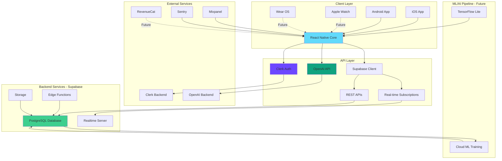
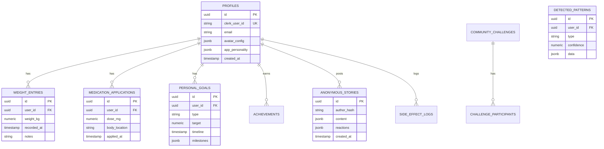
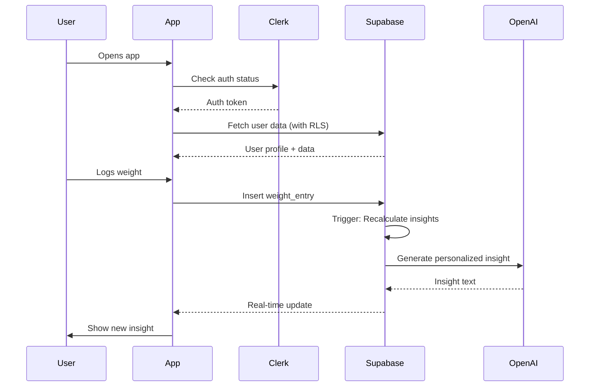
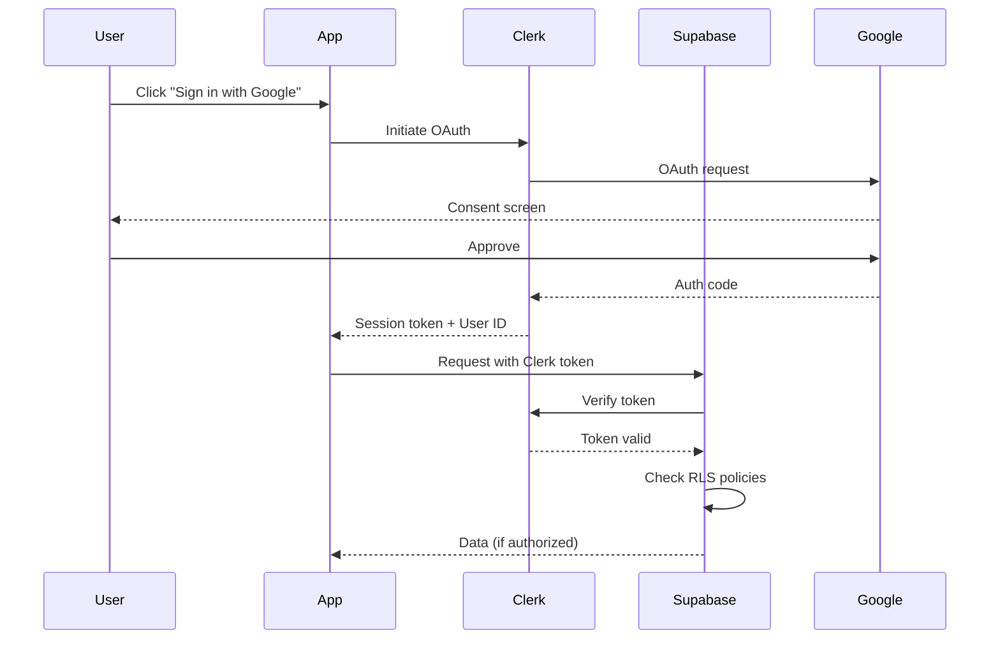

# Shotsy: Technical Architecture

> Arquitetura técnica completa do app Shotsy

**Versão:** 1.0
**Data:** 2025-11-01
**Status:** Living Document

---

## Visão Geral

Shotsy é um aplicativo mobile multiplataforma (iOS/Android) construído com arquitetura **serverless, cloud-native** que prioriza:

- **Performance:** <2s tempo de carregamento, 60fps animações
- **Scalability:** Suportar 100K+ usuários
- **Security:** Privacy-first, HIPAA-ready
- **Reliability:** 99.9% uptime
- **Developer Experience:** Fast iteration, type-safe

---

## Architecture Diagram



---

## Technology Stack

### Frontend (Client)

```typescript
const frontendStack = {
  // Core
  framework: 'React Native 0.74+',
  runtime: 'Expo SDK 51+',
  language: 'TypeScript 5.3+',

  // State Management
  globalState: 'Zustand 4.x',
  serverState: 'React Query (TanStack) 5.x',

  // Navigation
  router: 'Expo Router (file-based)',

  // UI/Styling
  designSystem: 'Tamagui | NativeWind', // Under evaluation
  animations: 'Reanimated 3 + Skia',
  gestures: 'React Native Gesture Handler 2.x',
  charts: 'Victory Native XL',

  // Utils
  forms: 'React Hook Form + Zod',
  dates: 'date-fns',
  http: 'axios | fetch',

  // Developer Tools
  linter: 'ESLint + TypeScript ESLint',
  formatter: 'Prettier',
  testing: 'Jest + React Native Testing Library',
  e2e: 'Detox',
};
```

### Backend (Server)

```typescript
const backendStack = {
  // Database
  database: 'Supabase (PostgreSQL 15+)',
  orm: 'Supabase Client (PostgREST)',
  realtime: 'Supabase Realtime (WebSockets)',

  // Auth
  authentication: 'Clerk',
  authorization: 'Supabase RLS (Row Level Security)',

  // Storage
  files: 'Supabase Storage',
  cache: 'Redis (future, via Upstash)',

  // Serverless Functions
  functions: 'Supabase Edge Functions (Deno)',
  cron: 'pg_cron (PostgreSQL)',

  // AI/ML
  llm: 'OpenAI GPT-4 Turbo',
  embeddings: 'OpenAI text-embedding-3',
  vectorDB: 'pgvector (PostgreSQL extension)',
  ml: 'TensorFlow Lite (on-device)',

  // Infrastructure
  hosting: 'Supabase Cloud',
  cdn: 'Cloudflare (future)',
  queue: 'BullMQ + Redis (future)',
};
```

### DevOps & Monitoring

```typescript
const devopsStack = {
  // CI/CD
  ci: 'GitHub Actions',
  deployment: 'EAS (Expo Application Services)',

  // Monitoring
  errors: 'Sentry',
  analytics: 'Mixpanel + Amplitude',
  performance: 'Sentry Performance',
  logging: 'Supabase Logs + Better Stack (future)',

  // Payments
  subscriptions: 'RevenueCat (Fase 8)',

  // Communication
  notifications: 'Expo Notifications | OneSignal',
  email: 'Resend | SendGrid (future)',
};
```

---

## Data Architecture

### Database Schema (Simplified)



### Data Flow



---

## Security Architecture

### Authentication Flow



### Row Level Security (RLS)

Todas as tabelas principais têm RLS policies:

```sql
-- Exemplo: Weight entries apenas do próprio usuário
CREATE POLICY "Users can view own weight entries"
  ON weight_entries
  FOR SELECT
  USING (auth.uid() = user_id);

CREATE POLICY "Users can insert own weight entries"
  ON weight_entries
  FOR INSERT
  WITH CHECK (auth.uid() = user_id);

-- Comunidade: Stories são anônimas
CREATE POLICY "Anyone can view public stories"
  ON anonymous_stories
  FOR SELECT
  USING (visibility = 'public');

CREATE POLICY "Users can insert stories (anonymously)"
  ON anonymous_stories
  FOR INSERT
  WITH CHECK (author_hash = encode(digest(auth.uid()::text, 'sha256'), 'hex'));
```

### Data Privacy

```typescript
interface PrivacyLayers {
  // 1. Transport Security
  https: 'All traffic over HTTPS/TLS 1.3+';

  // 2. Authentication
  auth: 'Clerk JWT tokens with short expiry';

  // 3. Authorization
  rls: 'Supabase RLS - database-level access control';

  // 4. Data Storage
  encryption: {
    atRest: 'AES-256 (Supabase default)';
    inTransit: 'TLS 1.3';
    e2e: 'Signal Protocol for buddy chat (Fase 3)';
  };

  // 5. Anonymization
  community: {
    stories: 'Hashed user IDs, zero PII';
    analytics: 'Aggregated only, no individual tracking';
  };

  // 6. Compliance
  future: ['HIPAA (Fase 9)', 'GDPR', 'CCPA'];
}
```

---

## Performance Architecture

### Client-Side Performance

```typescript
interface PerformanceStrategy {
  // 1. Bundle Optimization
  bundling: {
    codesplitting: 'Route-based with Expo Router';
    treeshaking: 'Enabled in production';
    compression: 'Gzip + Brotli';
  };

  // 2. Rendering Performance
  rendering: {
    lists: 'FlashList for long lists (not FlatList)';
    images: 'expo-image with caching';
    animations: 'Reanimated 3 (UI thread)';
  };

  // 3. Data Fetching
  fetching: {
    cache: 'React Query with staleTime';
    prefetch: 'Predictive prefetching';
    pagination: 'Infinite scroll with windowing';
  };

  // 4. State Management
  state: {
    optimization: 'Zustand selective subscriptions';
    persistence: 'AsyncStorage with compression';
  };
}
```

### Backend Performance

```typescript
interface BackendPerformance {
  // 1. Database
  database: {
    indexing: 'Strategic indexes on frequent queries';
    materialized_views: 'Pre-computed aggregations';
    partitioning: 'Time-based partitioning for large tables';
    connection_pooling: 'PgBouncer';
  };

  // 2. Caching
  caching: {
    database: 'PostgreSQL query cache';
    application: 'Redis for session/frequent data (future)';
    cdn: 'Cloudflare for static assets (future)';
  };

  // 3. Real-time
  realtime: {
    channels: 'Filtered subscriptions (not all data)';
    throttling: 'Client-side debouncing';
    batching: 'Batch updates when possible';
  };
}
```

### Performance Budgets

```typescript
const performanceBudgets = {
  // Metrics
  metrics: {
    ttfb: '< 200ms', // Time to First Byte
    fcp: '< 1s', // First Contentful Paint
    lcp: '< 2s', // Largest Contentful Paint
    tti: '< 2.5s', // Time to Interactive
    fps: '60fps', // Animations
    bundleSize: '< 5MB', // Initial bundle
  },

  // API Response Times
  api: {
    read: '< 300ms (p95)',
    write: '< 500ms (p95)',
    ai_generation: '< 5s (p95)',
  },
};
```

---

## Scalability Architecture

### Current Scale (MVP - Phase 1-3)

```typescript
const currentScale = {
  users: '1K - 10K',
  requests: '10K - 100K/day',
  database: 'Supabase Free/Pro tier',
  infrastructure: 'Managed (Supabase + Clerk + Expo)',
};
```

### Target Scale (Phase 9)

```typescript
const targetScale = {
  users: '100K - 1M',
  requests: '1M - 10M/day',
  database: 'Supabase Team/Enterprise tier',
  infrastructure: {
    database: {
      readReplicas: '2-3 replicas for read scaling',
      connectionPooling: 'PgBouncer with 100+ connections',
      partitioning: 'Monthly partitions for time-series data',
    },
    caching: {
      redis: 'Upstash Redis for sessions/hot data',
      cdn: 'Cloudflare for global asset delivery',
    },
    functions: {
      edgeFunctions: 'Auto-scaling with Supabase',
      queueing: 'BullMQ for async processing',
    },
    monitoring: {
      apm: 'Full APM with Datadog/New Relic',
      alerting: 'PagerDuty for critical issues',
    },
  },
};
```

### Scaling Triggers

```typescript
interface ScalingTriggers {
  // Quando escalar Database
  database: ['CPU > 70% sustained', 'Connection pool saturation', 'Query latency > 500ms p95'];

  // Quando adicionar Cache
  cache: ['Repeated queries same data', 'Read/Write ratio > 10:1'];

  // Quando otimizar Backend
  backend: ['API latency > 1s p95', 'Error rate > 1%'];
}
```

---

## AI/ML Architecture (Phases 2, 4, 6)

### Phase 2: Basic Insights

```typescript
interface BasicInsights {
  approach: 'Rule-based + Simple Statistics';
  location: 'Cloud Functions';

  patterns: {
    weeklyTrends: 'PostgreSQL aggregations';
    correlations: 'Basic statistical correlation';
    anomalies: 'Standard deviation detection';
  };
}
```

### Phase 4: Educational AI

```typescript
interface EducationalAI {
  approach: 'RAG (Retrieval Augmented Generation)';
  model: 'OpenAI GPT-4 Turbo';

  architecture: {
    knowledge_base: ['Medical articles (vetted)', 'Drug information', 'Scientific studies'];

    pipeline: [
      '1. User question',
      '2. Embed question (text-embedding-3)',
      '3. Vector search in pgvector',
      '4. Retrieve relevant docs',
      '5. GPT-4 generates answer with sources',
      '6. Add disclaimers',
    ];
  };
}
```

### Phase 6: Predictive AI

```typescript
interface PredictiveAI {
  approach: 'Custom ML Models + LLM';

  models: {
    weight_prediction: {
      type: 'Time-series forecasting';
      framework: 'TensorFlow Lite';
      location: 'On-device';
      inputs: ['historical_weight', 'applications', 'activity'];
      output: 'Next 30 days weight forecast';
    };

    plateau_detection: {
      type: 'Anomaly detection';
      framework: 'Scikit-learn → TFLite';
      location: 'On-device';
      inputs: ['weight_trend', 'rate_of_change'];
      output: 'Plateau probability';
    };

    optimal_timing: {
      type: 'Personalized recommendation';
      framework: 'Cloud ML (Vertex AI)';
      location: 'Cloud';
      inputs: ['historical_patterns', 'side_effects', 'lifestyle'];
      output: 'Best time for next application';
    };
  };

  training: {
    approach: 'Federated Learning (privacy-preserving)';
    frequency: 'Weekly model updates';
    validation: 'Holdout set + A/B testing';
  };
}
```

---

## Error Handling & Resilience

### Error Handling Strategy

```typescript
interface ErrorHandling {
  // 1. Client Errors
  client: {
    network: "Retry with exponential backoff",
    auth: "Refresh token, then re-login",
    validation: "Show user-friendly messages",
    unknown: "Fallback UI + report to Sentry"
  },

  // 2. Server Errors
  server: {
    5xx: "Retry up to 3 times",
    rate_limit: "Queue requests, show warning",
    timeout: "Cancel + show offline state"
  },

  // 3. Data Errors
  data: {
    corruption: "Validate on read, flag + skip",
    missing: "Graceful degradation",
    sync_conflict: "Last-write-wins (with timestamp)"
  }
}
```

### Offline Support

```typescript
interface OfflineSupport {
  // Phase 1-3: Basic offline
  basic: {
    storage: 'AsyncStorage for critical data';
    queueing: 'Queue writes when offline';
    sync: 'Sync on reconnection';
  };

  // Phase 9-10: Full offline
  advanced: {
    database: 'WatermelonDB (local SQL)';
    sync: 'Differential sync';
    conflict_resolution: 'CRDT or timestamp-based';
  };
}
```

---

## Development Workflow

### Local Development

```bash
# 1. Clone repo
git clone https://github.com/yourorg/shotsy.git
cd shotsy

# 2. Install dependencies
npm install

# 3. Environment setup
cp .env.example .env.local
# Configure: SUPABASE_URL, CLERK_PUBLISHABLE_KEY, etc.

# 4. Start development
npm run start

# 5. Run on simulator/device
npm run ios
npm run android
```

### Code Organization

```
shotsy/
├── app/                        # Expo Router pages
│   ├── (auth)/                # Auth screens
│   │   ├── sign-in.tsx
│   │   ├── sign-up.tsx
│   │   └── onboarding.tsx
│   ├── (tabs)/                # Main app tabs
│   │   ├── _layout.tsx
│   │   ├── index.tsx          # Dashboard
│   │   ├── add-weight.tsx
│   │   ├── add-application.tsx
│   │   └── community.tsx
│   └── _layout.tsx
│
├── components/                # React components
│   ├── ui/                    # Design system components
│   │   ├── Button.tsx
│   │   ├── Card.tsx
│   │   └── Input.tsx
│   ├── dashboard/             # Dashboard-specific
│   │   ├── WeightChart.tsx
│   │   └── InsightCard.tsx
│   ├── community/             # Community features
│   └── shared/                # Shared components
│
├── lib/                       # Core libraries
│   ├── supabase.ts           # Supabase client
│   ├── clerk.ts              # Clerk config
│   ├── ai/                   # AI utilities
│   │   ├── openai.ts
│   │   └── insights.ts
│   ├── analytics/            # Analytics
│   │   ├── mixpanel.ts
│   │   └── sentry.ts
│   └── utils/                # Utilities
│
├── hooks/                    # Custom React hooks
│   ├── useAuth.ts
│   ├── useWeights.ts
│   ├── useApplications.ts
│   └── useInsights.ts
│
├── stores/                   # Zustand stores
│   ├── userStore.ts
│   └── themeStore.ts
│
├── types/                    # TypeScript types
│   ├── database.types.ts     # Auto-generated from Supabase
│   ├── api.types.ts
│   └── models.ts
│
├── constants/                # Constants
│   ├── colors.ts
│   ├── themes.ts
│   └── config.ts
│
└── supabase/                 # Supabase specific
    ├── migrations/           # Database migrations
    └── functions/            # Edge functions
```

### Testing Strategy

```typescript
interface TestingStrategy {
  // 1. Unit Tests (80%+ coverage)
  unit: {
    what: 'Business logic, utilities, hooks';
    framework: 'Jest';
    location: '__tests__/ folders';
  };

  // 2. Component Tests
  component: {
    what: 'UI components, user interactions';
    framework: 'React Native Testing Library';
    location: 'components/**/*.test.tsx';
  };

  // 3. Integration Tests
  integration: {
    what: 'API calls, data flow, auth';
    framework: 'Jest';
    location: 'tests/integration/';
  };

  // 4. E2E Tests
  e2e: {
    what: 'Critical user journeys';
    framework: 'Detox';
    location: 'e2e/';
    scenarios: ['Sign up → Onboarding → Log weight', 'View insights', 'Join community challenge'];
  };
}
```

---

## Deployment Architecture

### CI/CD Pipeline

```yaml
# .github/workflows/deploy.yml
name: Deploy

on:
  push:
    branches: [main, staging]

jobs:
  test:
    runs-on: ubuntu-latest
    steps:
      - Checkout code
      - Install dependencies
      - Run linter
      - Run tests
      - Run type check

  build:
    needs: test
    runs-on: ubuntu-latest
    steps:
      - Build with EAS
      - Upload to TestFlight (iOS)
      - Upload to Internal Testing (Android)

  deploy-backend:
    needs: test
    runs-on: ubuntu-latest
    steps:
      - Deploy Edge Functions to Supabase
      - Run database migrations
      - Verify deployment
```

### Release Strategy

```typescript
interface ReleaseStrategy {
  // Phase 1-3: Beta
  beta: {
    frequency: 'Weekly';
    distribution: 'TestFlight + Internal Testing';
    testers: '50-100 beta users';
    rollback: 'Manual';
  };

  // Phase 4+: Production
  production: {
    frequency: 'Bi-weekly';
    distribution: 'App Store + Play Store';
    rollout: 'Gradual (10% → 50% → 100%)';
    rollback: 'Automated via EAS';
    featureFlags: 'LaunchDarkly or custom';
  };
}
```

---

## Monitoring & Observability

### Key Metrics

```typescript
interface MonitoringMetrics {
  // 1. Application Health
  health: {
    uptime: '99.9% target';
    errorRate: '< 1%';
    crashRate: '< 0.1%';
  };

  // 2. Performance
  performance: {
    apiLatency: 'p50, p95, p99';
    screenLoadTime: 'Per screen';
    fps: 'Animation smoothness';
  };

  // 3. Business
  business: {
    dau: 'Daily Active Users';
    retention: 'D1, D7, D30';
    conversion: 'Free → Premium';
    churn: 'Monthly churn rate';
  };

  // 4. User Experience
  ux: {
    featureAdoption: '% using each feature';
    sessionDuration: 'Average session time';
    nps: 'Net Promoter Score';
  };
}
```

### Alerting

```typescript
interface Alerts {
  critical: ['Error rate > 5%', 'Crash rate > 1%', 'API latency p95 > 3s', 'Database CPU > 90%'];

  warning: ['Error rate > 2%', 'API latency p95 > 1s', 'Slow queries detected'];

  info: ['New version deployed', 'Traffic spike detected'];
}
```

---

## Future Architecture Considerations

### Phase 9-10: Enterprise Scale

```typescript
interface EnterpriseArchitecture {
  // 1. Multi-region
  regions: {
    primary: 'US-East';
    replicas: ['US-West', 'EU-West'];
    routing: 'GeoDNS for latency optimization';
  };

  // 2. Microservices (if needed)
  services: {
    core: 'User, Auth, Data';
    ml: 'Separate ML service';
    community: 'Separate Community service';
  };

  // 3. Advanced Caching
  caching: {
    l1: 'In-memory (client)';
    l2: 'Redis (server)';
    l3: 'CDN (static)';
  };
}
```

---

## Conclusion

Esta arquitetura foi projetada para:

1. **Iniciar rápido:** MVP com Expo + Supabase em semanas
2. **Escalar gradualmente:** De 1K para 1M usuários sem rewrites
3. **Manter simples:** Managed services, serverless quando possível
4. **Priorizar UX:** Performance e reliability em primeiro lugar
5. **Segurança forte:** Privacy-first desde dia 1

---

**Próximos Passos:**

- [Implementation Guide](../guides/IMPLEMENTATION-GUIDE.md)
- [Tech Decisions Log](../decisions/TECH-DECISIONS.md)
- [API Documentation](./API-DOCS.md)

**Última Atualização:** 2025-11-01
**Autor:** Tech Lead
**Próxima Revisão:** 2025-12-01
